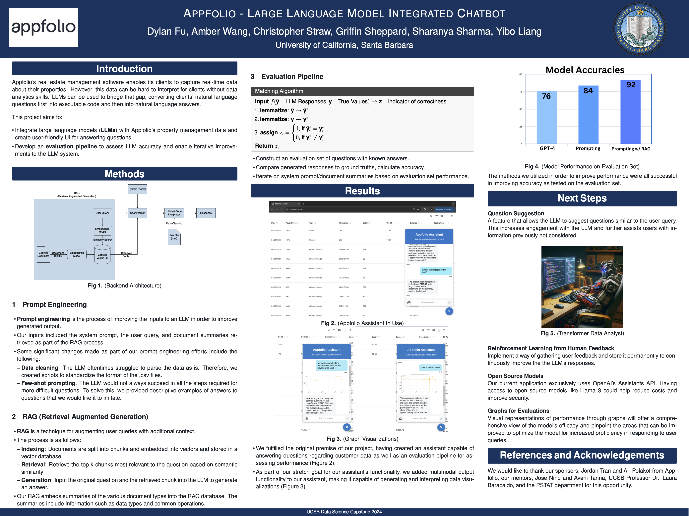
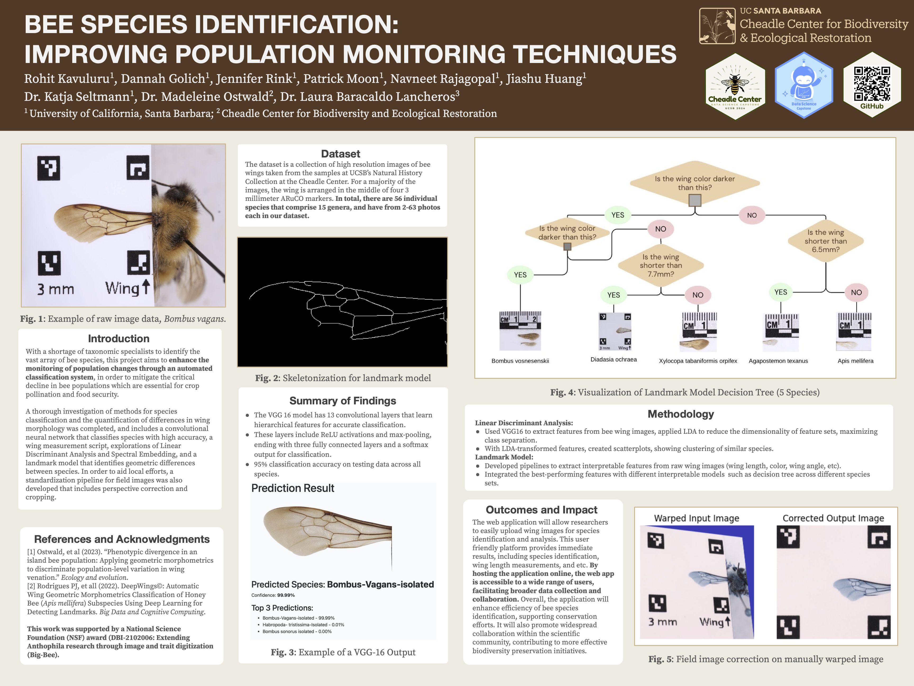
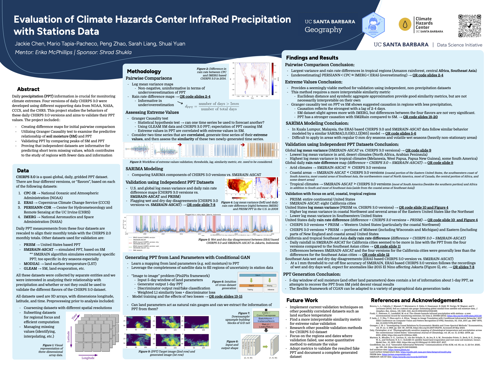
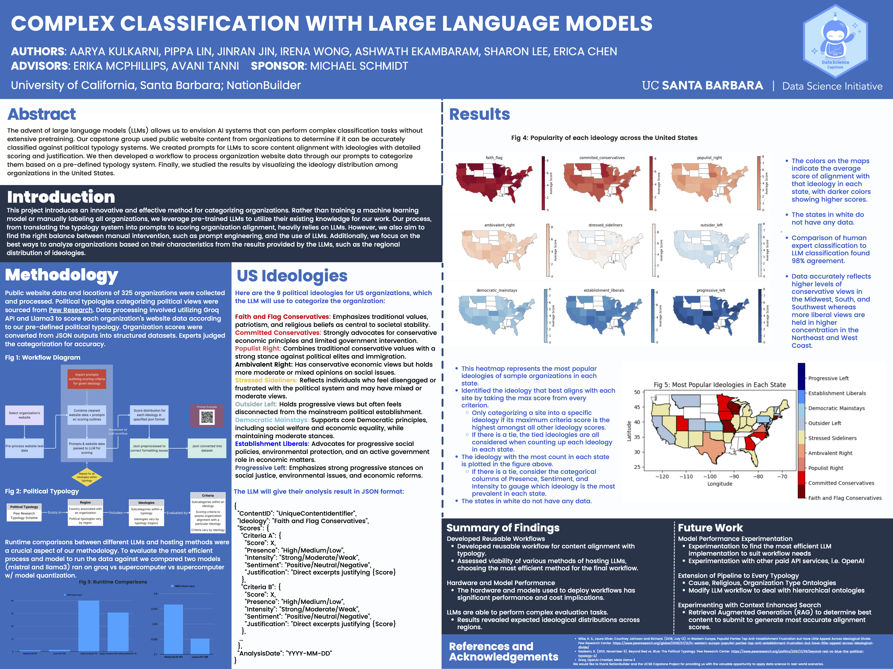
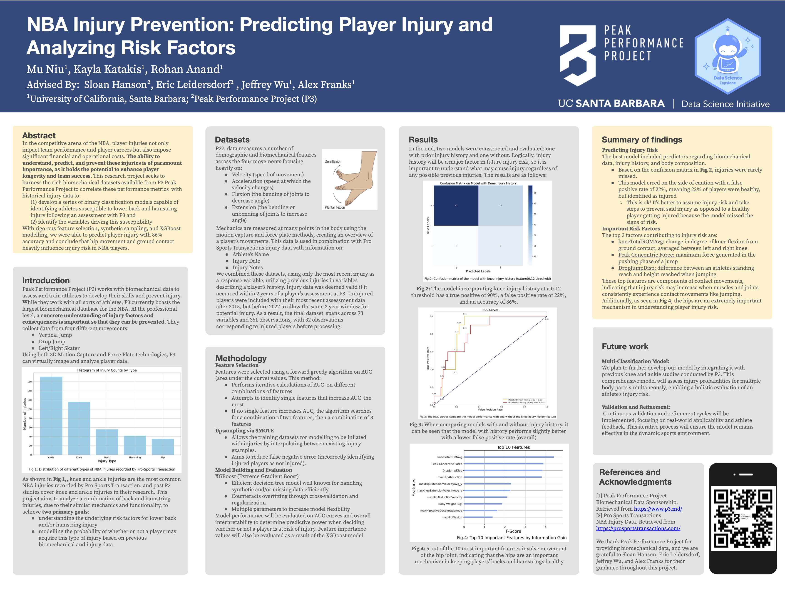
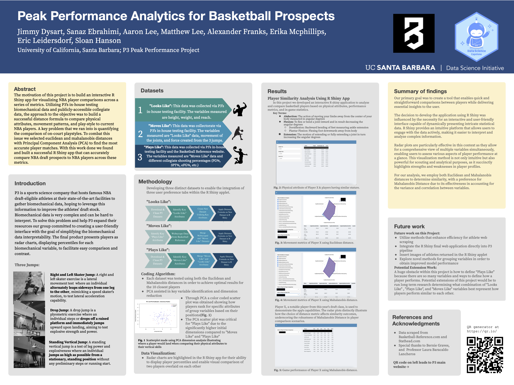
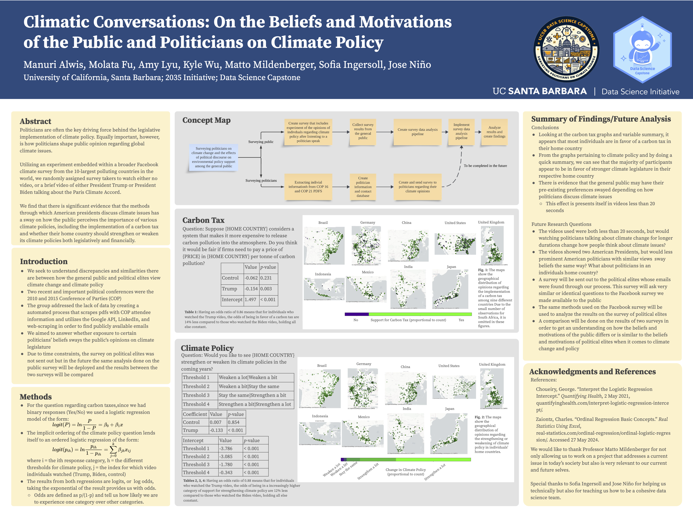
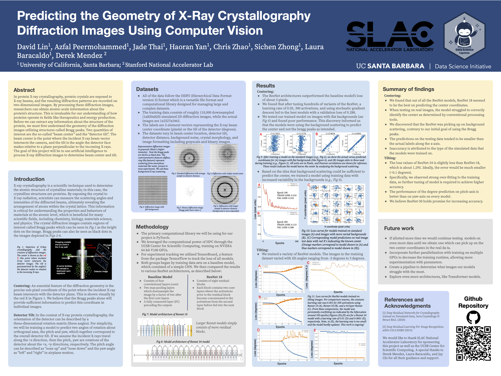

Listed alphabetically by project sponsor.

## Appfolio

***Large language model integrated chatbot***

**Student team:** Dylan Fu, Amber Wang, Christopher Straw, Griffin Sheppard, Sharanya Sharma, Yibo Liang
**Mentors:** *Jordan Tran*, *Ari Polakof*
**Advisors:** Jose Niño, Laura Baracaldo

Appfolio’s real estate management software enables its clients to capture real-time data about their properties. However, this data can be hard to interpret for clients without data analytics skills. LLMs can be used to bridge that gap, converting clients’ natural language questions first into executable code and then into natural language answers. This project aims to: Integrate large language models (LLMs) with Appfolio’s property management data and create user-friendly UI for answering questions. Develop an evaluation pipeline to assess LLM accuracy and enable iterative improvements to the LLM system.

::: column-screen

:::

---

## UCSB Cheadle Center

***Bee Species Identification: Improving Population Monitoring Techniques***

**Student team:** Rohit Kavuluru, Dannah Golich, Jennifer Rink, Patrick Moon, Navneet Rajagopal, Jiashu Huang
**Mentor:** *Dr. Madeleine Ostwald*
**Advisors:** Dr. Katja Seltmann, Dr. Laura Baracaldo Lancheros

With a shortage of taxonomic specialists to identify the vast array of bee species, this project aims to enhance the monitoring of population changes through an automated classification system, in order to mitigate the critical decline in bee populations which are essential for crop pollination and food security. A thorough investigation of methods for species classification and the quantification of differences in wing morphology was completed, and includes a convolutional neural network that classifies species with high accuracy, a wing measurement script, explorations of Linear Discriminant Analysis and Spectral Embedding, and a landmark model that identifies geometric differences between species. In order to aid local efforts, a standardization pipeline for field images was also developed that includes perspective correction and cropping.

::: column-screen

:::

---

## UCSB Center for Innovative Teaching, Research, and Learning (CITRAL)

***Did I Get the Job? Analysis of Longitudinal Hiring Trends in University of California Biology Departments***

**Student team:** Ayushmaan Gandhi, Claire Lee, Mindy Xu, Ryan Sevilla, Yijiao Wang, Zoe Zhou
**Mentor:** *UCSB CITRAL*
**Advisors:** Nate Emory, Yan Lashchev

Unlocking the secrets of faculty hiring within the university system takes us on a journey through the heart of academic evolution. This project explores the hiring shresholds, starting with a collection and analysis of curricula vitae (CVs) from the University of California (UC) faculty to uncover hidden patterns in hiring networks and publication trends. We achieved our goal by developing a web scraper to establish likely pronouns for professors, investigating hiring timelines for PhD graduates, and mapping hiring networks from PhD institutions to UC campuses. The primary goal of our project is to understand past and present hiring trends to improve future recruitment.

::: column-screen
.png)
:::

---

## UCSB Geography and Climate Hazards Center

***Evaluation of Climate Hazards Center InfraRed Precipitation with Stations Data***

**Student team:** Jackie Chen, Mario Tapia-Pacheco, Peng Zhao, Sarah Liang, Shuai Yuan
**Mentors:** *Shrad Shukla*
**Advisors:** Erika McPhillips

Daily precipitation (PPT) information is crucial for monitoring climate extremes. Four versions of daily CHIRPS 3.0 were developed using different supporting data from NOAA, NASA, CCCS, and the CHRS. This project studies the behaviors of these daily CHIRPS 3.0 versions and aims to validate their PPT values. The project included the following: Creating difference maps for initial pairwise comparison; Utilizing Granger Causality test to examine the predictive relationship of soil moisture (SM) and PPT; Validating PPT by comparing peaks of SM and PPT; Proving that independent datasets are informative for predicting short term missing values, which contributes to the study of regions with fewer data and information.

::: column-screen

:::

---

## NationBuilder

***Complex Classification with Large Language Models***

**Student team:** Aarya Kulkarni, Pippa Lin, Jinran Jin, Irena Wong, Ashwath Ekambaram, Sharon Lee, Erica Chen
**Mentors:** Michael Schmidt
**Advisors:** Erika McPhillips, Avani Tanni 

The advent of large language models (LLMs) allows us to envision AI systems that can perform complex classification tasks without extensive pretraining. Our capstone group used public website content from organizations to determine if it can be accurately classified against political typology systems. We created prompts for LLMs to score content alignment with ideologies with detailed scoring and justification. We then developed a workflow to process organization website data through our prompts to categorize them based on a pre-defined typology system. Finally, we studied the results by visualizing the ideology distribution among organizations in the United States.

::: column-screen

:::

---

## Peak Performance Project (P3)

***NBA Injury Prevention: Predicting Player Injury and Analyzing Risk Factors***

**Student team:** Mu Niu, Kayla Katakis, Rohan Anand
**Mentors:** Sloan Hanson, Eric Leidersdorf
**Advisors:** Jeffrey Wu, Alexander Franks

In the competitive arena of the NBA, player injuries not only impact team performance and player careers but also impose significant financial and operational costs. The ability to understand, predict, and prevent these injuries is of paramount importance, as it holds the potential to enhance player longevity and team success. This research project seeks to harness the rich biomechanical datasets available from P3 Peak Performance Project to correlate these performance metrics with historical injury data to: (1) develop a series of binary classification models capable of identifying athletes susceptible to lower back and hamstring injury following an assessment with P3; and (2) identify the variables driving this susceptibility. With rigorous feature selection, synthetic sampling, and XGBoost modelling, we were able to predict player injury with 86% accuracy and conclude that hip movement and ground contact heavily influence injury risk in NBA players.

::: column-screen

:::

---

***Peak Performance Analytics for Basketball Prospects***

**Student team:** Jimmy Dysart, Sanaz Ebrahimi, Aaron Lee, Matthew Lee
**Mentors:** Sloan Hanson, Eric Leidersdorf
**Advisors:** Erika McPhillips, Alexander Franks

The motivation of this project is to build an interactive R Shiny app for visualizing NBA player comparisons across a series of metrics. Utilizing P3ʼs in-house testing biomechanical data and publicly-accessible collegiate data, the approach to the objective was to build a successful distance formula to compare physical attributes, movement patterns, and play-style to current NBA players. A key problem that we ran into is quantifying the comparison of on-court playstyles. To combat this issue we selected euclidean and mahalanobis distances with Principal Component Analysis (PCA) to find the most accurate player matches. With this work done we found and built a successful R Shiny app that can accurately compare NBA draft prospects to NBA players across these metrics.

::: column-screen

:::

---

## UCSB Political Science, 2035 Initiative

***Climatic Conversations: On the Beliefs and Motivations of the Public and Politicians on Climate Policy***

**Student team:** Manuri Alwis, Molata Fu, Amy Lyu, Kyle Wu
**Mentors:** Matto Mildenberger
**Advisors:** Sofia Ingersoll, Jose Nino

Politicians are often the key driving force behind the legislative implementation of climate policy. Equally important, however, is how politicians shape public opinion regarding global climate issues. Utilizing an experiment embedded within a broader Facebook climate survey from the 10-largest polluting countries in the world, we randomly assigned survey takers to watch either no video, or a brief video of either President Trump or President Biden talking about the Paris Climate Accord. We find that there is significant evidence that the methods through which American presidents discuss climate issues has a sway on how the public perceives the importance of various climate policies, including the implementation of a carbon tax and whether their home country should strengthen or weaken its climate policies both legislatively and financially.

::: column-screen

:::

---

## Stanford National Accelerator Laboratory

***Predicting the Geometry of X-Ray Crystallography Diffraction Images Using Computer Vision***

**Student team:** David Lin, Azfal Peermohammed, Jade Thai, Haoran Yan, Chris Zhao, Sichen Zhong
**Mentors:** Derek Mendez
**Advisors:** Laura Baracaldo

In protein X-ray crystallography, protein crystals are exposed to X-ray beams, and the resulting diffraction patterns are recorded on two-dimensional images. By processing these diffraction images, researchers can obtain atomic-scale information about the proteinʼs structure. This is invaluable for our understanding of how proteins operate in fields like therapeutics and energy production. Before we can extract any information about the structure of the protein, we must first understand the geometry of the diffraction images utilizing structures called Bragg peaks. Two quantities of interest are the so-called “beam center” and the “detector tilt”. The beam center is the point where the incident X-ray beam vector intersects the camera, and the tilt is the angle the detector face makes relative to a plane perpendicular to the incoming X-rays. The goal of this project will be to use artificial intelligence to process X-ray diffraction images to determine beam center and tilt.

::: column-screen

:::