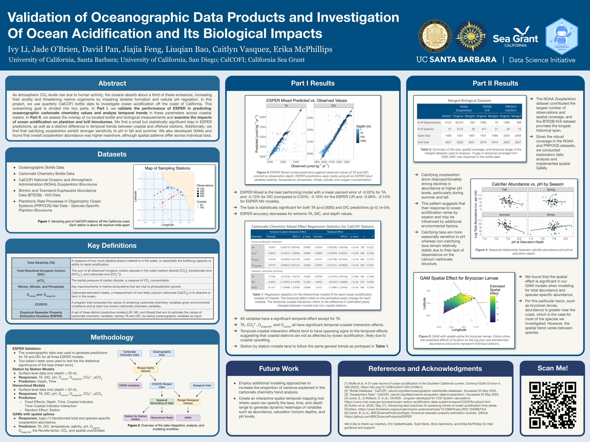
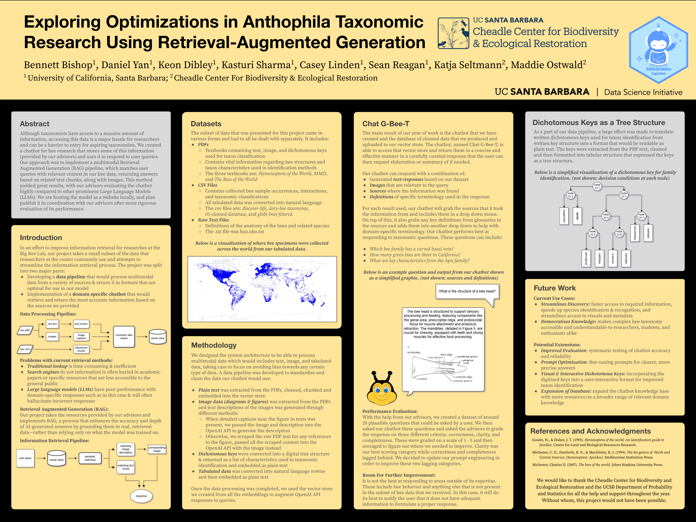
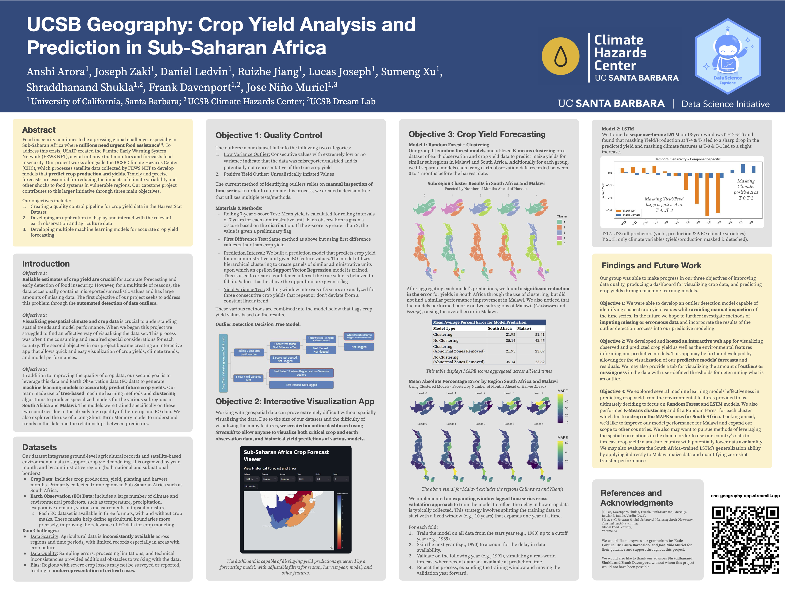

Listed alphabetically by project sponsor.

## CalCOFI

***Application of Habitat Compression Thresholds to the CalCOFI OA Dataset***

**Student team:** David Pan, Jiajia Feng, Liuqian Bao, Caitlyn Vasquez, Jade O'Brien, Ivy Li  
**Mentor:** *Erin Satterthwaite*
**Advisors:** Erika McPhillips

The goal of this project is to apply the habitat compression threshold concept being used in modeling studies (e.g., LiveOcean/ROMS-BEC) to the CalCOFI Ocean Acidification (OA) dataset, to understand how environmental conditions like pH and carbonate chemistry impact marine species.

Students will apply species-specific habitat compression thresholds to the OA dataset to determine how long and how often environmental conditions fall below critical values. They will analyze both spatial and temporal patterns, including what percentage of the CalCOFI grid is affected seasonally and where consistent OA "hotspots" occur. Deliverables include code, spatial maps, and summary statistics that reveal how often and where habitat quality is threatened by acidification.

::: column-screen

:::

---

## CCBER

***Developing a Bee-Specific Large Language Model***

**Student team:** Sean Reagan, Bennett Bishop, Keon Dibley, Daniel Yan, Kasturi Sharma, Casey Linden  
**Mentor:** *Maddie Oswald*
**Advisors:** Katja Seltmann

Bees are vital pollinators, yet the entomological data needed to support their conservation is often too specialized for general-purpose LLMs. This project aims to develop a bee-specific LLM trained on curated datasets from the Big-Bee lab at UCSB's Cheadle Center.

Students will explore how to answer questions like “Which bees are colored green in Santa Barbara County?” and “What plants should I plant for spring-flying bees in Goleta?” by integrating floral records, nesting data, taxonomic texts, and bee images. The final product will support conservation strategies, research, and educational outreach across California.

::: column-screen

:::

---

## Geography Department

***Climatic and Socioeconomic Drivers of Crop Yield in Sub-Saharan Africa***

**Student team:** Lucas Joseph, Ruizhe Jiang, Daniel Ledvin, Joseph Zaki, Sumeng Xu, Anshi Arora  
**Mentor:** *Shraddhanand Shukla*

This project will investigate climatic and socioeconomic factors influencing crop yields in sub-Saharan Africa, with the goal of improving predictive models that support early warnings for food insecurity. Students will work with remote sensing data, socioeconomic indicators, and statistical or machine learning models to identify key yield determinants and help build tools that anticipate regional food crises.

::: column-screen

:::

---

## NationBuilder

***Using Generative AI to Expand Civic Participation***

**Student team:** Pramukh Shankar, Luke Dillon, Wentao Zhang, Candis Wu, Colin Nguyen, Sophia Mirrashidi  
**Mentors:** *Michael Schmidt and Yvonne Baur*

This project proposes using generative AI to automate the collection and verification of political candidacy information nationwide. By streamlining data acquisition for Run for Office, the team will help address the problem of uncontested U.S. elections (currently 60%) and improve civic engagement.

Students will design a system that uses LLMs or other generative models to scrape, process, and validate candidacy data for local elections. The goal is to empower more citizens to discover leadership opportunities in their communities.

---

## SLAC National Accelerator Laboratory

***AI-Guided Protein Crystallization***

**Student team:** Jaxon Zhang, Ben Drabeck, Rebecca Chang, Reese Karo, Shirley Wang  
**Mentor:** *Derek Anthony Mendez Jr.*

Protein crystal quality determines whether their atomic structure can be resolved via X-ray diffraction. This project aims to train an AI model to classify images of crystallization samples using a labeled dataset (e.g., MARCO) and then improve it with fine-grained classes (e.g., “crystal rods”).

Students will work in a Unix environment, write Python and PyTorch code, and collaborate via GitHub. If time allows, they may explore using generative AI to expand their labeled training set. The resulting model will support structural biology and drug development efforts.

---

## SLO County Probation Department

***Validation Study of Youth Risk Assessment Tool***

**Student team:** Yamileth Martinez, Xiaofeng Cai, Jiaxin Su, Henry Louie, Leena-Karima Anqud, William Mahnke, James San  
**Mentor:** *Larissa Heeren*

San Luis Obispo County Probation uses the Youth Level of Service/Case Management Inventory (YLS/CMI) to assess juvenile reoffending risk. This project will validate the tool’s predictive accuracy using local data.

Students will compare numeric risk scores and risk categories (low, medium, high) to actual reoffending outcomes, analyze demographic disparities in predictive power, and recommend cut-point revisions if appropriate. This project offers applied experience in criminal justice, risk modeling, and fairness assessment.

---

## SoundEthics

***Detecting AI-Generated Audio for Artist Protection***

**Student team:** Kuan-I Lu, Jiahui He, Nazhah Mir, Parker Reedy, Tess Ivinjack, Navin Lo  
**Mentor:** *James O'Brien*

As AI-generated voices become more realistic, detecting deepfakes is critical for protecting musicians and voice artists. This project offers students the opportunity to build detectors for AI-generated singing, speech, or generative music.

Students will curate datasets, extract features, clean data, and train models capable of distinguishing AI from human audio. The work directly supports SoundEthics’ mission to ensure ethical and transparent use of AI in the creative arts.

---

## UCSD Scripps Institute of Oceanography

***Modeling Marine Mammal Density from Environmental Data***

**Student team:** Ziqian Zhao, Joshua Charfauros, Valerie De La Fuente, Samantha Su, Peter Xiong, Justin Lang  
**Mentor:** *Michaela Alksne*

Using long-term CalCOFI data, this project will build an integrated species distribution model (SDM) to predict marine mammal density in Southern California. Students will clean and analyze environmental predictors and use tools like `tinyVAST` or `sdmTMB` in R to build the model.

The final model will incorporate acoustic, visual, and eDNA detections and be visualized in an RShiny app. This hands-on project blends ecology, oceanography, and spatial modeling.

---

## UCSB Climate Hazards Center

***Forecast Skill Assessment for Temperature and Precipitation***

**Student team:** Hannah Kim, Edwin Yang, Sanchit Mehrotra, Johnson Sy Leung, Ivan Li, Sophie Shi  
**Mentor:** *Laura Harrison*

This project will evaluate the accuracy (skill) of global precipitation and temperature forecasts used in climate applications. Students may also develop statistical models to improve forecast skill, depending on interest and project scope.

The work contributes to improving early warning systems for climate-driven hazards and supports the global mission of the Climate Hazards Center.

---

## UCSB Political Science / 2035 Initiative

***Modeling the Energy Labor Transition in the Central Coast***

**Student team:** Mai Uyen Huynh, Carter Kulm, Owen Philliber, Nikhil Kuniyil, Christina Hefan Cui, Amy Ji  
**Mentor:** *Lucas Boyd*

This project will model demographic and employment trends for energy-sector workers in the SLO–SB–Ventura region. Students will work with American Community Survey (ACS) and BLS/O*NET datasets to generate zip-code-level profiles of energy jobs and labor skills over time.

The output will be a spatially rich report showing how workforce patterns intersect with the renewable energy transition—supporting the 2035 Initiative's efforts to build equitable, region-specific climate policy.
